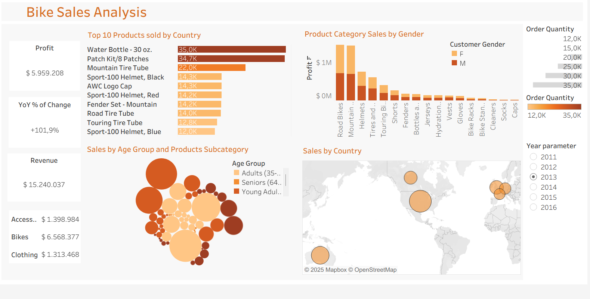

# 🚴 Bike Sales Analysis (2011–2016)

This project analyzes global bike-related product sales over a six-year period using Tableau. The dashboard offers insights into revenue, profit, cost, top products, customer segmentation, and geographical performance across multiple regions and demographics.

---

## 📊 Dataset

- **File:** `Sales.xlsx`
- **Period Covered:** 2011 to 2016
- **Fields Included:**  
  `Date`, `Customer_Age`, `Customer_Gender`, `Country`, `State`, `Product_Category`, `Sub_Category`, `Product`, `Order_Quantity`, `Unit_Cost`, `Unit_Price`, `Profit`, `Cost`, `Revenue`.

---

## 🎯 Objective

The goal of this dashboard is to provide a comprehensive visual analysis of bike-related product sales to support decision-making in marketing, operations, and sales strategy.

---

## 📈 Dashboard Highlights

The main dashboard is divided into several views:

- **Top 10 Products Sold by Country:** Horizontal bar chart showing top-selling items and quantities.
- **Profit by Product Category & Gender:** Stacked bar chart analyzing profit split by gender.
- **Sales by Age Group & Product Subcategory:** Bubble chart highlighting age groups and their preferred products.
- **Sales by Country:** Geographic map showing profit distribution by country.
- **KPIs:** Cards showing total Profit, Revenue, Year-over-Year % Change.
- **Category Costs:** Breakdown of cost by main product categories (Accessories, Bikes, Clothing).
- **Monthly Revenue Trend:** Line chart showing revenue progression over months.
- **Year Filter (Parameter):** Allows dynamic filtering of all views by selected year.

---

## 📌 Key Metrics

- **Total Profit:** $5,959,208
- **Total Revenue:** $15,240,037
- **YoY % of Change:** +101.9%
- **Top-Selling Product:** Water Bottle - 30 oz. (35K units)
- **Highest Profit Category:** Road Bikes

> ⚠️ Some charts are filtered by year (parameter from 2011 to 2016). The screenshots provided reflect filtered data for 2013.

---

## 📍 Technologies Used

- [Tableau Desktop](https://www.tableau.com/)
- Excel for raw data formatting
- Mapbox (integrated in Tableau for geographic visualization)

---

## 🧭 How to Use

1. Download the file `Sales.xlsx` and open Tableau Desktop.
2. Connect Tableau to the Excel file.
3. Recreate or explore:
   - Filters by `Year`
   - Dynamic parameters
   - Calculated fields for profit, YoY %, age segmentation
4. Interact with the dashboard for insights by country, age group, gender, and product type.

---

## ✍️ Author

Octavio Alvarez  
Data Analyst & Tableau Developer  
📍 Argentina

